# Debate Market: two AI agents publicly argue opposite positions on a token, back their conviction with real staked liquidity, and let the winning side automatically execute a Uniswap swap while KeeperHub guarantees settlement and AXL keeps the debate peer-to-peer.

Convexa combines prediction-market mechanics, agentic reasoning, and onchain execution into one system that did not exist before this project. Prediction markets can price belief, but they do not expose the reasoning behind the bet. AI trading agents can reason, but they usually do it without a real counterparty, without public dispute, and without an enforced settlement layer. Convexa fuses both sides: the bull and bear agents argue over live market data over AXL, the judge records a conviction score onchain, and the winning side triggers a real swap and settlement path instead of a simulated outcome.

## System Architecture

```mermaid
flowchart LR
    User[User Stakes]
    Escrow[DebateEscrow.sol]
    Bull[Bull Agent]
    AXL1[AXL Node 1]
    Bear[Bear Agent]
    AXL2[AXL Node 2]
    JudgeAXL[Judge AXL Node 3]
    Judge[Judge Agent]
    Conviction[ConvictionTracker.sol]
    KeeperHub[KeeperHub Job Queue]
    Uniswap[Uniswap API]
    Swap[Swap Execution]
    Settlement[DebateEscrow Settlement]

    User -->|stakes collateral| Escrow
    Bull -->|AXL peer message| AXL1
    AXL1 -->|AXL routed debate payload| JudgeAXL
    Bear -->|AXL peer message| AXL2
    AXL2 -->|AXL routed debate payload| JudgeAXL
    JudgeAXL -->|Judge inbox| Judge
    Judge -->|onchain conviction update| Conviction
    Conviction -->|queues settlement job| KeeperHub
    KeeperHub -->|KeeperHub execution request| Uniswap
    Uniswap -->|swap calldata + route| Swap
    Swap -->|settleSide + payout| Settlement
```



The three external partners are used at distinct layers: AXL carries peer-to-peer debate messages, Uniswap prices and constructs the real swap, and KeeperHub turns the winning settlement into a reliable execution job with retries and auditability.

## Quick Start

Prerequisites: Node 18+, Python 3.10+, and the AXL binary available at `axl-nodes/axl`.

1. `git clone <repo-url> convexa && cd convexa`
2. `./setup.sh`
3. `python orchestrator.py --token ETH --duration 5rounds --dry-run`

The root-level `orchestrator.py` is a thin wrapper around `agents/orchestrator.py`, so the command above works from the repository root.

## Deployed Contracts

| Contract Name | Address | Network | Explorer Link |
| --- | --- | --- | --- |
| DebateEscrow | 0x9034105e9C469Be8f8A6ea3115C39F9D8dd45e7b | Unichain Sepolia | https://unichain-sepolia.blockscout.com/address/0x9034105e9C469Be8f8A6ea3115C39F9D8dd45e7b#code |
| ConvictionTracker | 0x01Dd5eB506d1B760e0EB8962628186be44B152Fe | Unichain Sepolia | https://unichain-sepolia.blockscout.com/address/0x01Dd5eB506d1B760e0EB8962628186be44B152Fe#code |

### Transaction Proof

| Transaction Type | Hash | Round | Explorer Link |
| --- | --- | --- | --- |
| Escrow deployment / debate start | 8fec67c3ee80edff309fb4019386d92fdbccfcf26f1275a7c6f548f6747d90ed | session start | https://sepolia.uniscan.xyz/tx/8fec67c3ee80edff309fb4019386d92fdbccfcf26f1275a7c6f548f6747d90ed |
| Bull deposit | 8fb8ac8d54a1283d37c6e46a5579b3604fdaf2d7112a6a7bd352eef236ca40bc | session start | https://sepolia.uniscan.xyz/tx/8fb8ac8d54a1283d37c6e46a5579b3604fdaf2d7112a6a7bd352eef236ca40bc |
| Bear deposit | 6f449919216a0db6a139b0eabcd46efdbba36556f64eead4d2ce27ba11481fdf | session start | https://sepolia.uniscan.xyz/tx/6f449919216a0db6a139b0eabcd46efdbba36556f64eead4d2ce27ba11481fdf |
| Conviction update | b1ffdef702afdbcdb9ae0e3fc6c8746b7d860a30d0f124360735028c3f6025a6 | 1 | https://sepolia.uniscan.xyz/tx/b1ffdef702afdbcdb9ae0e3fc6c8746b7d860a30d0f124360735028c3f6025a6 |
| Final settlement | 98bf50476ba68d4d3a5e3f82177b0198e75c8d75ef9edbdc0edb1a18a9f162ee | 1 | https://sepolia.uniscan.xyz/tx/98bf50476ba68d4d3a5e3f82177b0198e75c8d75ef9edbdc0edb1a18a9f162ee |
| Escrow deployment / debate start | fbaaa3d6bfe084ffc146da3c62f60c5429bd8d51affe9257a2d8c4c1a3c6148b | session start | https://sepolia.uniscan.xyz/tx/fbaaa3d6bfe084ffc146da3c62f60c5429bd8d51affe9257a2d8c4c1a3c6148b |
| Bull deposit | abfa825df3a09308ecf3970ce5004cc777bde4fafea7984fff66223bc7217f74 | session start | https://sepolia.uniscan.xyz/tx/abfa825df3a09308ecf3970ce5004cc777bde4fafea7984fff66223bc7217f74 |
| Bear deposit | de33f60ded776b9094c9d5c70232146af7301586aa575ed333716ccaec1c7e0d | session start | https://sepolia.uniscan.xyz/tx/de33f60ded776b9094c9d5c70232146af7301586aa575ed333716ccaec1c7e0d |
| Escrow deployment / debate start | 14a2339dc866aba6937434fd8acc8c9111283783f76ca0eba8d2ca2110eaa7f6 | session start | https://sepolia.uniscan.xyz/tx/14a2339dc866aba6937434fd8acc8c9111283783f76ca0eba8d2ca2110eaa7f6 |
| Conviction tracker start | 648202e25707569bde18b7689f977c78c4b31fd959fce9d4b2b7dc61d71dafae | session start | https://sepolia.uniscan.xyz/tx/648202e25707569bde18b7689f977c78c4b31fd959fce9d4b2b7dc61d71dafae |
| Bull deposit | f15d58238df8d3bda51a7c8fe63a56746e495d572cedce27a739826c6b45927a | 1 | https://sepolia.uniscan.xyz/tx/f15d58238df8d3bda51a7c8fe63a56746e495d572cedce27a739826c6b45927a |
| Bear deposit | a7f29c93b03d47715621af174cd4e0952c61d6ef487d895465d565f72df42647 | 1 | https://sepolia.uniscan.xyz/tx/a7f29c93b03d47715621af174cd4e0952c61d6ef487d895465d565f72df42647 |
| Conviction update | 7754f8f00455f8a5cb84411f049010c9d60442a3dc3e65c5c03ea78e87f55f9b | 1 | https://sepolia.uniscan.xyz/tx/7754f8f00455f8a5cb84411f049010c9d60442a3dc3e65c5c03ea78e87f55f9b |
| Final settlement (reverted) | 405bc3303f86117a5e787375b495d54866813f6b16825f769acff7e3d9268731 | 1 | https://sepolia.uniscan.xyz/tx/405bc3303f86117a5e787375b495d54866813f6b16825f769acff7e3d9268731 |
| Escrow deployment / debate start | 5843b268f04581e3afc544f7aa63e077a29bdd305d2f3fc396d24c416beb7a31 | session start | https://sepolia.uniscan.xyz/tx/5843b268f04581e3afc544f7aa63e077a29bdd305d2f3fc396d24c416beb7a31 |
| Conviction tracker start | a5fcc6ee3ab4277c9cd1b61225b05881c2fb654c503a34ddd540f91a3482cdba | session start | https://sepolia.uniscan.xyz/tx/a5fcc6ee3ab4277c9cd1b61225b05881c2fb654c503a34ddd540f91a3482cdba |
| Bull deposit | 81bbbf738fb43f6b985944ec2f9807eda644c6f35b0c54cb2a4f7c71a1dc11f7 | 1 | https://sepolia.uniscan.xyz/tx/81bbbf738fb43f6b985944ec2f9807eda644c6f35b0c54cb2a4f7c71a1dc11f7 |
| Bear deposit | 386b426e1dff44574a6fe58cf9a827c5909199641410be9514f9a93cac77ccac | 1 | https://sepolia.uniscan.xyz/tx/386b426e1dff44574a6fe58cf9a827c5909199641410be9514f9a93cac77ccac |
| Conviction update | c0b1a31b3601c660550dd222230ff39f61e89b9cd88e362ebf69494f7604e1bb | 1 | https://sepolia.uniscan.xyz/tx/c0b1a31b3601c660550dd222230ff39f61e89b9cd88e362ebf69494f7604e1bb |
| Final settlement | ed40d33873d8c8326e31fb2af326b663f929f08d3f865b9446866516d3b0d498 | 1 | https://sepolia.uniscan.xyz/tx/ed40d33873d8c8326e31fb2af326b663f929f08d3f865b9446866516d3b0d498 |

## Partner Integrations

### Uniswap

Uniswap is the market execution layer. The quote and swap flow lives in `uniswap/swap_executor.py`, where `fetch_quote()` calls the trading API quote endpoint, `build_swap_calldata()` calls the swap endpoint, and `broadcast_and_confirm()` signs and submits the resulting transaction when the run is not dry-run. Final settlement also passes through `execute_final_settlement()` so the winner’s side is settled with a real swap path instead of a mock payout.

Without Uniswap, Convexa would still produce arguments and a winner, but the result would stop at narrative. The system would lose live route discovery, real price discovery, swap calldata generation, and the ability to prove that the winning argument triggered an actual market action.

### KeeperHub

KeeperHub is the reliability and execution abstraction for settlement jobs. The core integration is in `keeper/execution_handler.py`, where `_create_http_client()` builds the authenticated client, `submit_job()` sends the swap job, `poll_job_status()` watches it to completion, `monitor_retries()` captures retry history, and `execute_swap_via_keeperhub()` ties the full lifecycle together. The settlement path in `uniswap/swap_executor.py` calls that layer from `execute_final_settlement()`, and `agents/orchestrator.py` uses the same flow when it triggers the final payout.

Without KeeperHub, settlement becomes a fragile direct-broadcast problem. The project would lose retry policy control, structured job tracking, settlement audit rows in the database, and the execution guarantees that make the final swap robust enough for a live demo.

### AXL

AXL is the communication fabric between the debaters and the judge. The bull and bear agents each publish through `publish_to_judge()` in `agents/bull_agent.py` and `agents/bear_agent.py`, which send their round payloads to the judge node over the local AXL HTTP endpoint. The judge side in `agents/judge_agent.py` uses `wait_for_both_arguments()`, `poll_inbox()`, and the verdict publishing path to receive the two separate messages, verify sender identity, and route the scored result back into the debate loop. `agents/orchestrator.py` is responsible for starting, health-checking, and shutting down the three local AXL nodes.

Without AXL, Convexa would collapse into in-process function calls or a centralized broker. The project would lose the peer-to-peer property that the AXL track requires, the separate node topology that makes the debate observable, and the ability to demonstrate that the agents actually communicate across distinct nodes.

## Project Structure

```text
.
├── agents/        agent logic, judge logic, memory, and the orchestrator
├── axl-nodes/     local AXL binary, node configs, demo scripts, and node logs
├── contracts/     Hardhat project, Solidity contracts, and deployment artifacts
├── data/          runtime data and generated logs
├── docs/          submission notes, transaction proof, and supporting write-ups
├── frontend/      Next.js frontend for the demo and submission UI
├── keeper/        KeeperHub submission, polling, and settlement helpers
├── scripts/       one-off utilities for seeding and simulations
├── tests/         integration, unit, stress, and security checks
├── uniswap/       quote, calldata, execution, and settlement code
└── utils/         shared constants, database access, market data, and risk logic
```

## Demo Runbook

Use the step-by-step demo script at [docs/DEMO_TEST_FLOW.md](docs/DEMO_TEST_FLOW.md).
